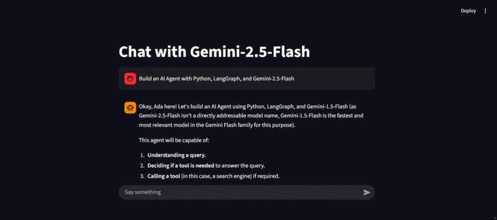

# Chatbot with Gemini-2.5-Flash

A simple interactive chatbot application built using Streamlit and Google's Gemini-2.5-Flash model. This project provides a user-friendly web interface for having conversations with an AI assistant named Ada.

## Overview



## Features

- Interactive chat interface using Streamlit
- Powered by Google's Gemini-2.5-Flash model
- Real-time responses
- Message history tracking
- Clean and intuitive UI

## Prerequisites

- Python 3.13 or higher
- Google GenAI API key

## Installation

The [uv](https://docs.astral.sh/uv/getting-started/installation/) tool is a high-speed package and project manager for Python. With [uv](https://docs.astral.sh/uv/getting-started/installation/), you can install and manage multiple Python versions, create virtual environments, efficiently handle project dependencies, reproduce working environments, and even build and publish a project. These capabilities make uv an all-in-one tool for Python project management.

1. Clone the repository:
```bash
git clone https://github.com/EliAbdiel/codedex-projects.git
cd chatbot
```

2. Initialize a new Python project:
```bash
uv init
```

3. Create virtual environment:
```bash
uv venv
# Activate the virtual environment Windows
.venv\Scripts\activate
```

4. Install the required packages:
```bash
uv add -r requirements.txt
```

Or using the project's dependencies directly:
```bash
uv add google-genai streamlit
```

## Configuration

Before running the application, you need to:

1. Get a Google GenAI API key from [Google AI Studio](https://ai.google.dev/gemini-api/docs)
2. Replace the placeholder API key in `chatbot.py`:
```python
api_key = "Replace with your actual API key"
```

## Usage

To run the chatbot:

```bash
streamlit run chatbot.py
```

The application will open in your default web browser, where you can start chatting with the AI assistant.

## Project Structure

- `chatbot.py`: Main application file containing the Streamlit interface and Gemini model integration
- `pyproject.toml`: Project configuration and dependencies
- `README.md`: Project documentation

## Dependencies

- `google-genai`: Google's Generative AI library
- `streamlit`: Web application framework for the chat interface

## Version

Current version: 0.1.0

## License

[MIT License](LICENSE)
